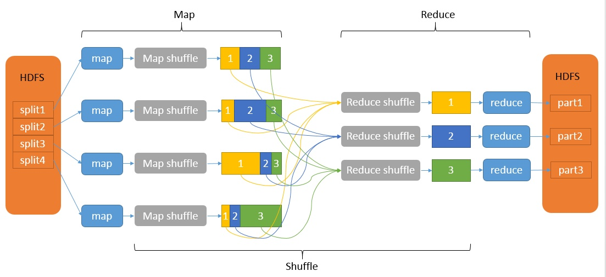
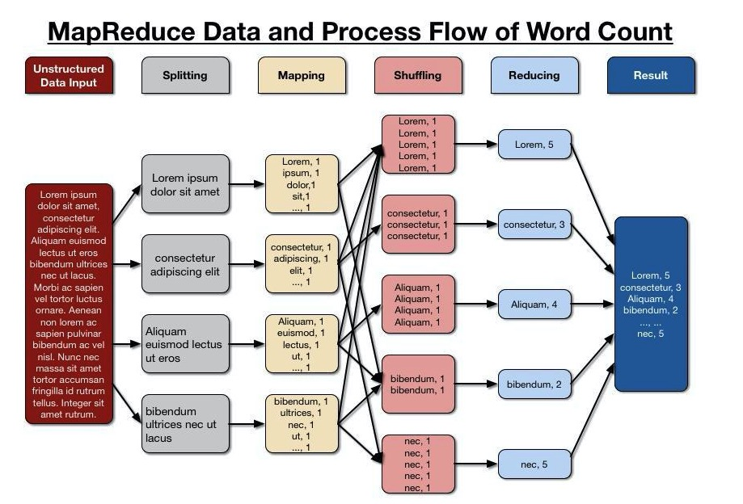

MapReduce概述：

官方：MapReduce是一种编程模型，用于大规模数据集（大于1TB）的并行运算。概念"Map（映射）"和"Reduce（归约）"，是它们的主要思想，都是从函数式编程语言里借来的，
还有从矢量编程语言里借来的特性。它极大地方便了编程人员在不会分布式并行编程的情况下，将自己的程序运行在分布式系统上。 当前的软件实现是指定一个Map（映射）函数，
用来把一组键值对映射成一组新的键值对，指定并发的Reduce（归约）函数，用来保证所有映射的键值对中的每一个共享相同的键组。

人话：MapReduce是一种适用于大数据下分布式并行计算的编程模型，只要按照规定完成Map（分发数据）和Reduce（处理数据）两部分工作，就可以快速得出结果。

MapReduce优点：海量数据离线处理&易开发&易运行
MapReduce缺点：实时流式计算

Map的任务是：处理原始数据、为数据打标签、对数据进行分发（严格来说这并不完全是map的职责）

Map和Reduce的职责并不是完全绝对的，比如过滤操作可以在Map，也可以在Reduce，只是因为在Map做可以减少传输的数据量，减少网络IO压力和时间消耗，所以做了上述的分工。

如果我们的任务是数清楚一袋子水果糖里，不同口味的糖有多少块。那么Map就是把糖分类，比如苹果味的放在第一个盘子里，草莓味的放在第二个盘子里；而Reduce就是执行的具体的计算任务，比如一个人数第一个盘子里的苹果味糖有几块，另一个人数第二个盘子里的草莓味糖有几块。最后通过这两个阶段来完成最开始的目标。

MapReduce编程模型之执行步骤：
准备map处理的输入数据
Mapper处理
Shuffle
Reduce处理

MapReduce编程模型之核心概念
Split
InputFormat
OutputFormat
Combiner
Partitioner

1 map先从HDFS上读取不同的文件，然后对其进行map操作，生成一个个带有标签（也就是key）的数据块。
2 带有相同标签（key）的数据块，会被分配到同一个Reduce上进行操作，从而得到最终结果，并将最终结果写回HDFS。

1 可以看到因为不是自带分区的文件，而是文本文件，所以多了一个拆分的步骤。
2 接下来对分割的文本进行Map阶段的操作，其分发的标签（key）是单词本身，分发的内容是每一段文本里出现该单词的数量。
3 接下来会进行一个分发操作，即相同标签（key）的数据会被收集到一起。
4 Reduce对收集之后分配过来的数据进行处理，最终结果汇总，就是单词计数的结果。

map
reducer
setup：初始化

打包运行：
vim pv.sh
hadoop jar /hadoop.xx.xx.jar com.hadoop.class1 hdfs://localhost:8020/project/input/raw/ hdfs://localhost:8020/project/v1/pvstat/
chmod u+x pv.sh
./pv.sh

Sqoop：把HDFS上的统计结果导出到mysql中
